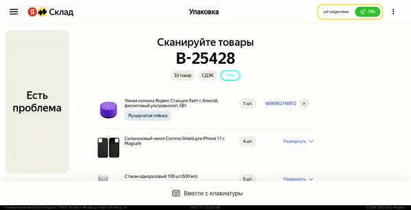

## Разработка веб приложения по подбору правильной упаковки для работника склада компании "Яндекс маркет", в рамках совместного хакатона для Data Science, Design, Backend, Frontend специалистов

### О проекте

Команда Frontend-разработки:



Команда DS-разработки:

- Ильичёв Иван: https://github.com/IvanDmitrich
- Дмитрий Кобылкин: https://github.com/dmitkin
- Валов Валерий: https://github.com/valov-vo

## Ссылка на Github Pages

- [Адуйский Антон](https://github.com/AntonAduisky)
- [Колганов Александр](https://github.com/MethodM4N)

#### Стэк технологий

- React.JS
- Router v6
- ReduxToolkit
- Web API
- CSS Modules
- SCSS
- сборщик Webpack (втч : минификация HTML,CSS,JS)
- код поделен на модули

## Стек технологий Frontend

```bash
# установка зависимостей
npm install
# старт проекта
npm run start

# сборка проекта
npm run build
```

## Стек DS/ML

```
- python
- pandas
- matplotlib
- sklearn
- optuna
- catboost
- tqdm
- py3dbp
```
## Ссылки на сторонние библиотеки

- Сторонние библиотеки не использовались

## Ключевые точки для media

- Ключевые точки отсутствуют

